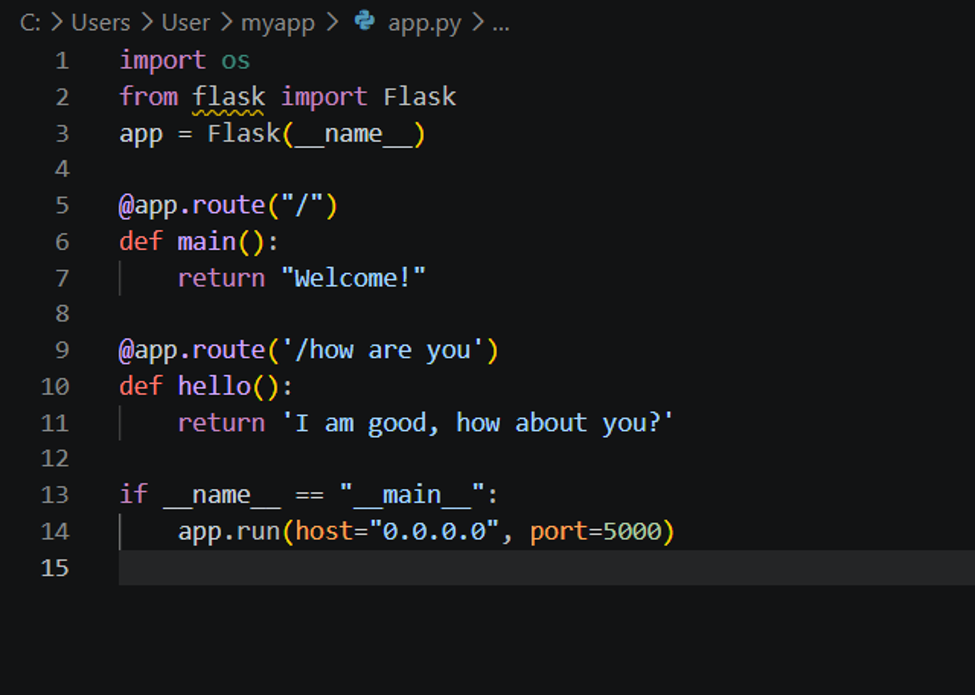
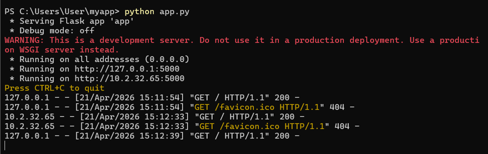
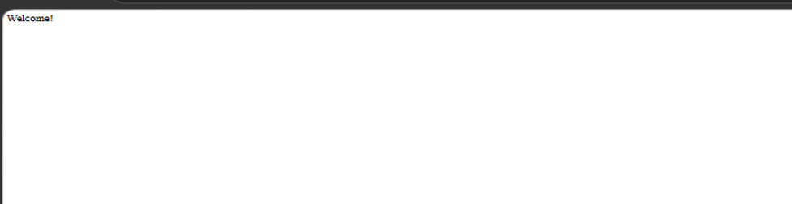
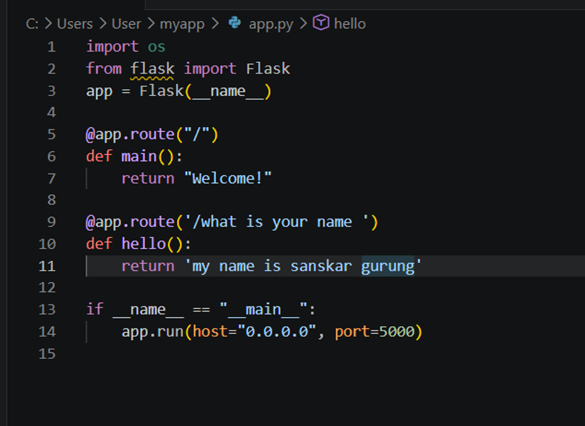
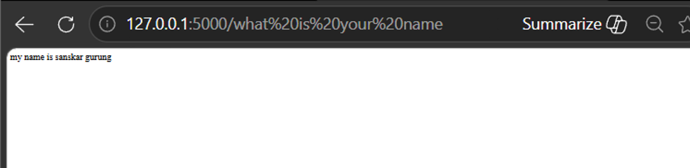
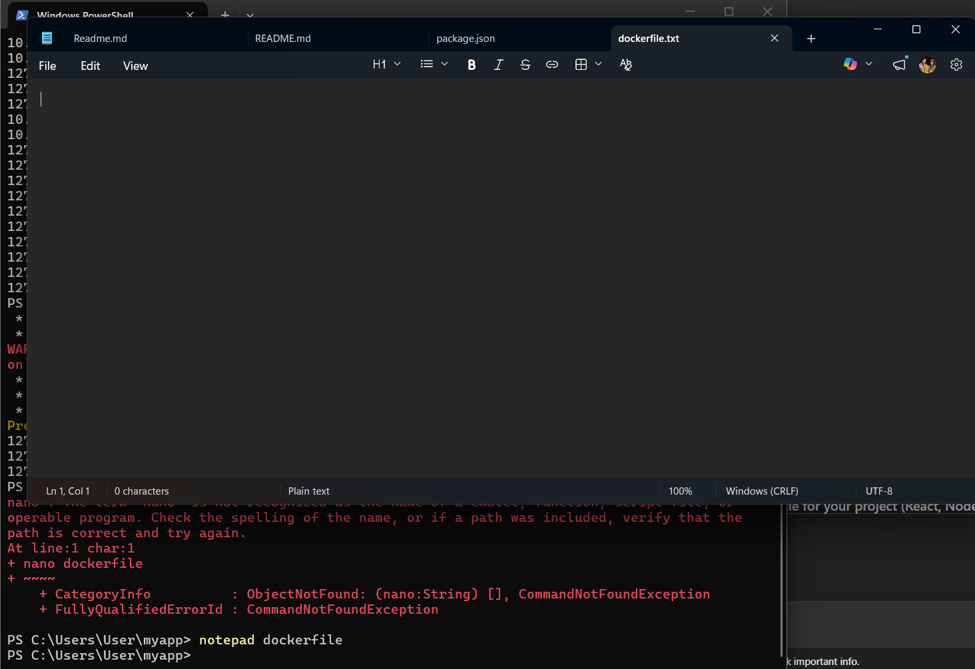
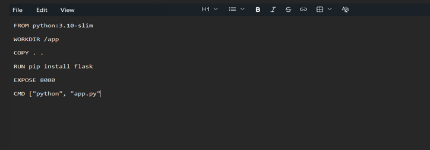
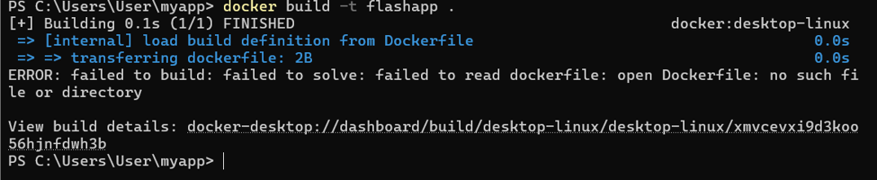
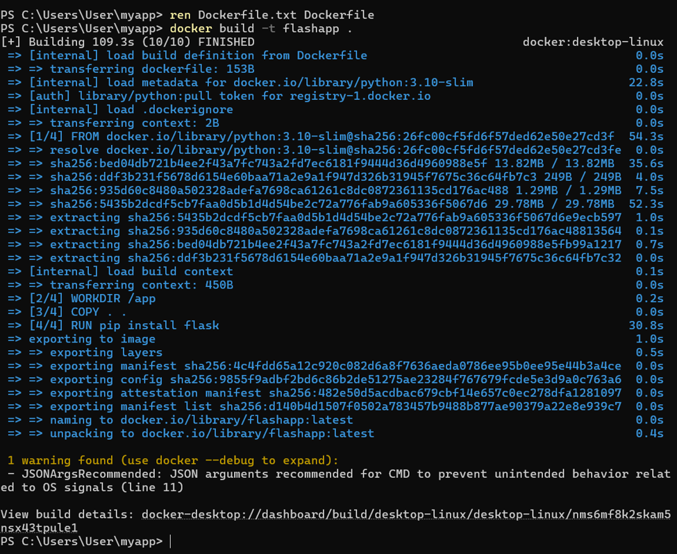

## Title: Building a Docker Image for an Application

# Aim:
To understand and perform the process of building a Docker image for an application using a Dockerfile.

# Objectives
•	To learn the concept of Docker image and container 
•	To create a Dockerfile for an application 
•	To build a Docker image using Docker commands 
•	To verify and run the created image 

# Theory:
Docker is a tool that allows development, packaging, deployment, and execution of applications in containers. Docker image refers to a light-weight, stand-alone package that includes everything required for running an application such as code, runtime, system tools, library, and settings.

Dockerfile refers to a text document that contains instructions for building Docker images. By using the command 'docker build,' Docker reads the Dockerfile and builds the image step-by-step.
Image is immutable; hence it does not change once it is created. Images are used to create containers, which are live instances of images.

Requirements
•	Docker installed on system 
•	Basic application (Node.js/any project) 
•	Dockerfile created in project folder 

## Procedure

Step 1: Create a Dockerfile
Create a file named Dockerfile in the project directory.
 -p : In linx is flag/ option(paraent)
 ~ : tilde/works
•	Flag is  extra instruction to add to a comment to change how that comment behaves. Specifical setting that modifies the action.
 cd. myapp - means “go inside the folder named myapp”

Step:2
Python app.py
 Python → starts the Python interpreter 
 app.py → the Python file you want to run
 
•	Inside the python it contains this;

•	While running on http://127.0.0.1:5000
Output;
 

## For next test.

## output

Step:3 Building docker image 
-	Nano dockerfile
-	Notepad dockrefile (will open the file)

 
Step: 4
•	Add this in your file

Step:5
-	Ren Dockerfile.tet dockerfile
-	Dockerbuild  -t flashapp  .

Step:6
-	Docker run  -p 8080: flashapp

## Conclusion

From this practical, I was able to comprehend how Docker functions and how to use it for containerizing an application.

A Python Flask application was developed alongside a Dockerfile which had various commands such as FROM, COPY, RUN, and CMD that dictate the environment needed by the application.

With the command: docker build -t flaskapp . , we built our Docker image. Using the command docker run -p 8080:5000 flaskapp we launched it as a container. It can be accessed via the browser: http://localhost:8080 .

Important Concept Learned: Docker containersizes applications together with their dependencies to ensure they run consistently across various environments.

## References
Merkel, D. (2014). Docker: Lightweight Linux containers for consistent development and deployment. Linux Journal, 2014(239), 2.
Docker Inc. (2024). Docker documentation: Get started. Docker. https://docs.docker.com/get-started/
Python Software Foundation. (2024). Flask documentation. Flask. https://flask.palletsprojects.com/
Turnbull, J. (2014). The Docker book: Containerization is the new virtualization. James Turnbull.
Mouat, A. (2015). Using Docker: Developing and deploying software with containers. O'Reilly Media.

