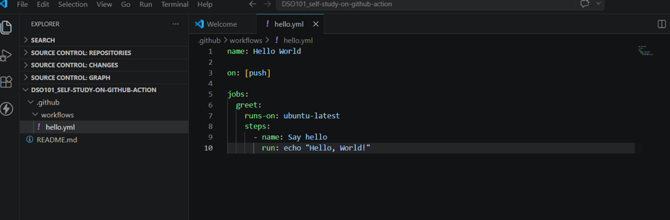
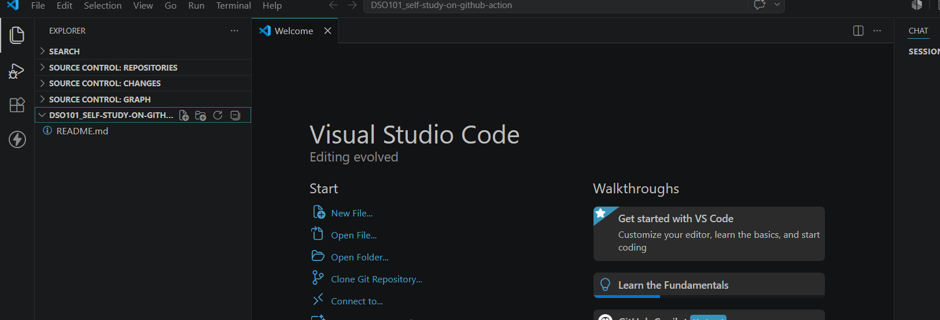
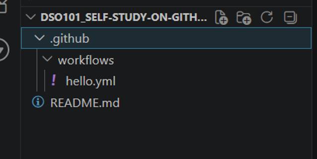
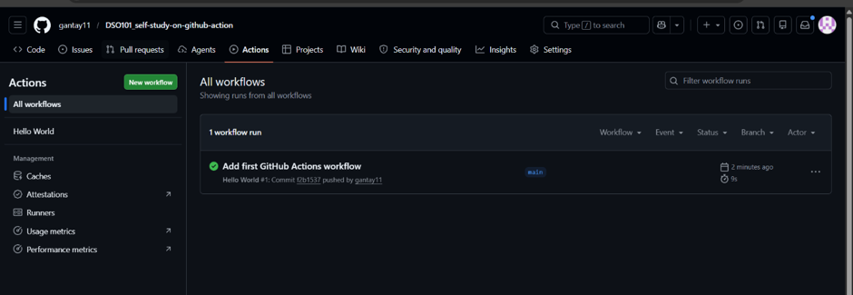

## Title: GitHub of Action

# Aim:
To understand and implement GitHub Actions as a CI/CD automation tool by creating and running a workflow that automatically executes tasks when code is pushed to a GitHub repository.

# Objectives:
1.	To understand what GitHub Actions is and how it works
2.	To create a GitHub repository for hosting the workflow
3.	To set up the .github/workflows/ directory structure
4.	To write a YAML workflow file defining triggers, jobs, and steps
5.	To push the workflow to GitHub and observe it running automatically
6.	To read and interpret the workflow execution logs

# Theory:
What is GitHub Actions?
GitHub Actions refers to a CI/CD platform that comes natively with GitHub. It enables programmers to automate the development processes of their software through features like building, testing, and deploying applications. With GitHub Actions, there is no need for external CI/CD platforms because GitHub Actions automates the process within its own platform.

## Basic Concepts
# Workflow
Workflow is the automated procedure that has been programmed within a YAML file located in the .github/workflows/ folder of a project. A workflow consists of one or more jobs and runs based on particular events like a push action, pull request, or scheduled execution.
Events (Triggers)
The event is an action that causes a workflow to execute. Types of events include:
•	push – executes when the code is pushed to a branch
•	pull_request – executes when a pull request has been created or updated
•	schedule – executes after a certain period of time has passed according to cron notation
•	workflow_dispatch – executes manually from the GitHub user interface

# Steps
A step refers to one of the individual tasks within the job. Steps can be divided into two categories depending on whether the user wants to run a command in a step or use a pre-defined action. In any case, the steps within a job get executed in sequence one after another.

# Actions
An action is a reusable piece of code that can perform a specific function. Actions are made public via the GitHub Marketplace and can be included in workflows. Examples of common actions include:
•	actions/checkout – clones the repository in the runner
•	actions/setup-node – sets up a particular version of Node.js
•	actions/setup-python – sets up a particular version of Python

# Runners
The term runner refers to a virtual machine running jobs from a workflow. These runners are available at GitHub and consist of popular operating systems
•	ubuntu-latest – Linux
•	windows-latest – Windows
•	macos-latest – macOS
Alternatively, developers can use self-hosted runners by deploying them to their machine or servers.

# Workflow File Structure
A GitHub Actions workflow file is written in YAML format. The basic structure is as follows:

How GitHub Actions Works
Once the developer commits his/her code in the GitHub repository, GitHub notices the event and scans the directory .github/workflows for any workflow file set up for the particular event. 

## Benefits of GitHub Actions

# Benefit         	 Description
Integration	      Built directly into GitHub — no external tools needed
Free tier	      Free for public repositories and generous limits for private repos
Flexibility	      Supports any language, framework, or platform
Reusability	      Thousands of pre-built actions available on the Marketplace
Scalability	      Supports parallel jobs and matrix builds
Security	      Secrets are encrypted and never exposed in logs

## CI/CD Pipeline using GitHub Actions

The GitHub Actions tool is widely used for building CI/CD pipelines.
Continuous Integration (CI) – builds and tests the code every time any developer makes modifications to the codebase, ensuring that the quality of the code remains consistent
Continuous Deployment (CD) – automatically deploys the application to a server/cloud service upon successful testing 

## Procedure
Tools and Requirements
Tool	Purpose
GitHub Account	To host the repository and run workflows
Visual Studio Code	To write and edit workflow files
Git	To push code to GitHub
PowerShell / Terminal	To run commands locally
Web Browser	To monitor workflow runs on GitHub

Step 1: Create a GitHub Repository
1.	Open a web browser and navigate to github.com
2.	Sign in to your GitHub account
3.	Click the + icon at the top right corner
4.	Select New repository
5.	Enter the repository name as DSO101_self-study-on-github-action
6.	Select Public as the visibility
7.	Check Add a README file
8.	Click Create repository

Step 2: Clone the Repository in VS Code
1.	Open Visual Studio Code
2.	The repository DSO101_self-study-on-github-action was opened in VS Code via Source Control

3.	The README.md file was visible in the Explorer panel confirming the repository was successfully cloned
 
Step 3: Create the Workflow Directory
1.	Open the terminal in VS Code by clicking Terminal → New Terminal

2.	Navigate to the repository folder:
•	cd DSO101_self-study-on-github-action
3.	Run the following commands to create the required folder structure:
•	mkdir .github
•	mkdir .github\workflows
4.	Create the workflow YAML file:
New-Item -ItemType File -Path ".github\workflows\hello.yml"
5.	Verify the folder structure in the VS Code Explorer panel:
Step 4: Write the Workflow File
1.	Click on hello.yml in the VS Code Explorer panel to open it
2.	Type the following YAML code into the file:
 
Step 5: Monitor the Workflow on GitHub
1.	Open a web browser and navigate to the GitHub repository
2.	Click on the Actions tab at the top of the repository page
3.	Observe that the workflow Hello World appeared under All workflows
4.	The workflow run was listed as "Add first GitHub Actions workflow" with a green checkmark  indicating success

5.	The run completed in 9 seconds

Step 6: Inspect the Workflow Logs
1.	Click on the workflow run "Add first GitHub Actions workflow #1"
2.	The summary page showed: 
	Status: Success
	Trigger: push
	Duration: 9 seconds
	Job: greet (completed in 3 seconds)
3.	Click on the greet job to expand the logs
4.	The following steps were visible: 
	 Set up job
	Say hello
	Complete job
5.	Inside the Say hello step, the following output was confirmed:

 

## Conclusion
In this practical session, GitHub Actions was successfully demonstrated as a CI/CD automation system available in GitHub. Workflow code in YAML format was written and kept in .github/workflows/. On pushing the code in the repository, GitHub Actions ran the workflow and executed the job in the specified virtual runner. The process ran successfully in 9 seconds, and the execution logs were viewed via GitHub Actions tab.
The above practical exercise has shown that GitHub Actions could be used as an automation system even without using any other software tools.

## References
1.	GitHub. (2024). GitHub Actions Documentation. Retrieved from https://docs.github.com/en/actions
2.	GitHub. (2024). Understanding GitHub Actions. Retrieved from https://docs.github.com/en/actions/learn-github-actions/understanding-github-actions
3.	GitHub. (2024). Workflow syntax for GitHub Actions. Retrieved from https://docs.github.com/en/actions/using-workflows/workflow-syntax-for-github-actions
4.	GitHub Marketplace. (2024). Actions. Retrieved from https://github.com/marketplace?type=actions
5.	Visual Studio Code. (2024). VS Code Documentation. Retrieved from https://code.visualstudio.com/docs

