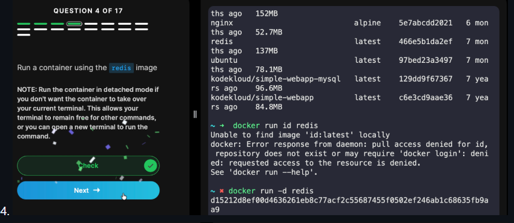
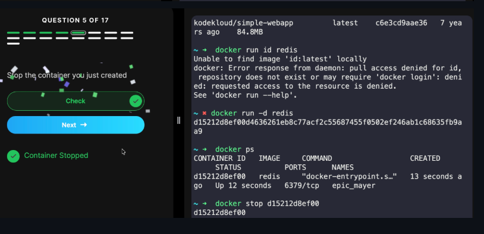
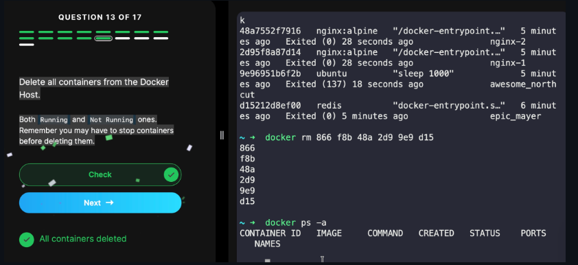
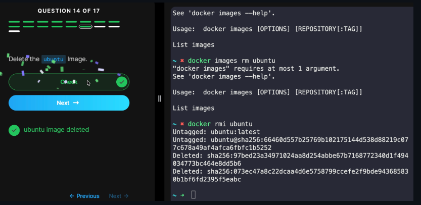
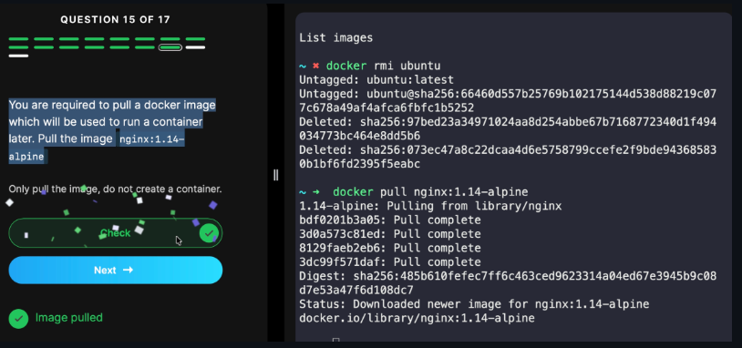
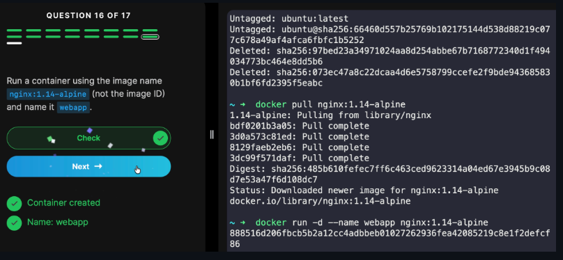
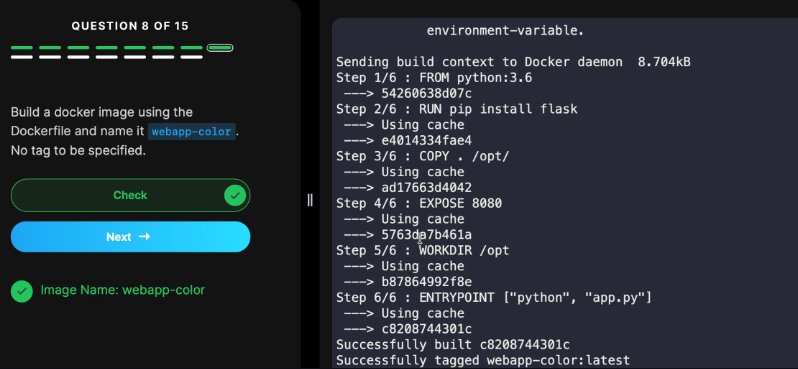
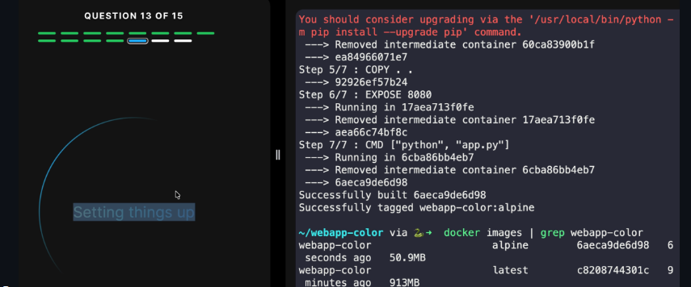
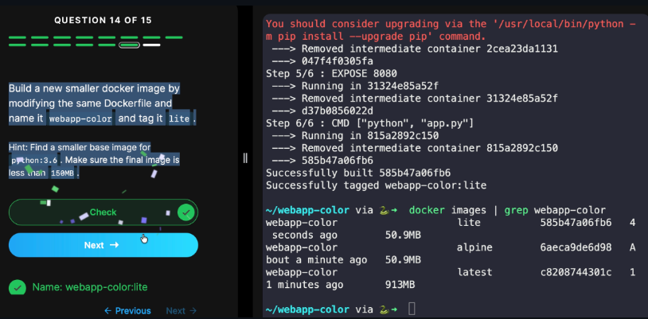
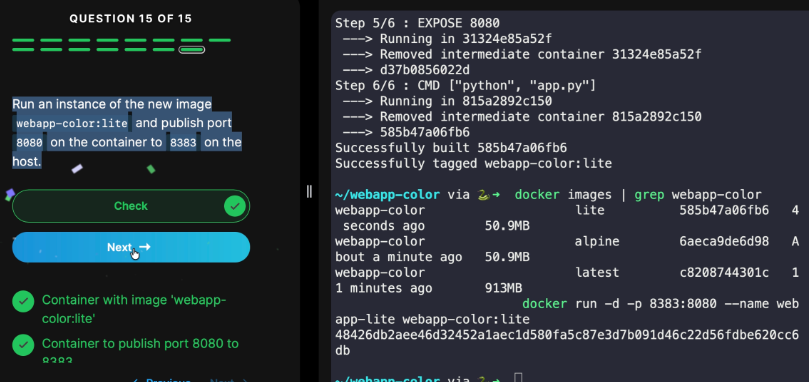

## Docker Lab
# Lab: Basic Commands
This lab consists of 17 questions. Answers are documented below according to their respective question numbers.
25.0.5
0
9

4 

0
4
6
nginx:alpine
awesome_northcut
866
Exited

13

14

15

## Docker Lab_2

# Lab: Docker Images
# Answer from 1 to 14
1.9
7.81 MB
1.14 - alpine
python:3.6
/opt
python app.py
8080

docker run -p 8282:8080 webapp-color
920 MB

13

14

# end
